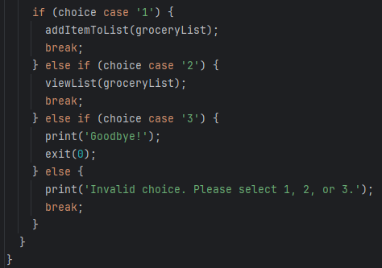
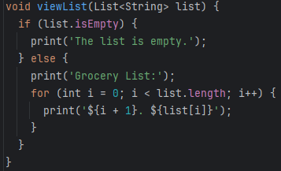
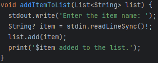

# NTV Verkefni 3
<h1>Criteria</h1>
<h2>Turn-in instructions:</h2>

    This assessment must be turned in via Git at github.com
    Each solution must be in a separate file, within the same project.
    Please add pictures of final output.

<table>
  <tr>
    <th>Assignment 1.</th>
  </tr>
  <tr>
    <td>Create an empty list to store the grocery items.

    Create a method called "addItemToList" that takes an item as input and adds it to the list.</td>
  </tr>
  <tr>
    <th>Assignment 1 Results.</th>
  </tr>
    <tr>
      <td>
         
      </td>
  </tr>
  <tr>
    <th>Assignment 2.</th>
  </tr>
  <tr>
    <td>Create a menu system that allows the user to choose between adding an item to the list, viewing the list, or ending the program.

    If the user chooses to add an item, prompt them for the item name and call the "addItemToList" method to add it to the list.
    </td>
  </tr>
  <tr>
      <th>Assignment 2 Results.</th>
  </tr>
  <tr>
      <td>
         
      </td>
  </tr>
    <tr>
    <th>Assignment 3.</th>
  </tr>
    <tr>
    <td>If the user chooses to view the list, display the contents of the list.</td>
  </tr>
    <tr>
    <th>Assignment 3 Results.</th>
  </tr>
    <tr>
      <td>
         
      </td>
  </tr>
    <tr>
    <th>Assignment 4.</th>
  </tr>
    <tr>
    <td>If the user chooses to end the program, exit the menu loop and end the program.
    </td>
  </tr>
      <tr>
    <th>Assignment 4 Results.</th>
  </tr>
    <tr>
      <td>
         
      </td>
  </tr>
</table>
<h1>Technologies</h1>
<ol>
    <li>
        <h3>Git</h3>

         
        Why <a href="https://git-scm.com/" target="_blank">Git</a>: 
        Git is a DevOps tool used for source code management. It is a free and open-source version control system used to handle small to very large projects efficiently. Git is used to tracking changes in the source code, enabling multiple developers to work together on non-linear development.
        

    </li>
    <li>
        <h3>Github</h3>

         
        Why <a href="https://github.com/" target="_blank">Github</a>: 
        Well It's used for storing, tracking, and collaborating on software projects. It makes it easy for developers to share code files and collaborate with fellow developers on open-source projects. GitHub also serves as a social networking site where developers can openly network, collaborate, and pitch their work 
        

    </li>
    <li>
        <h3>Dart</h3>

         
        Why <a href="https://dart.dev/" target="_blank">Dart</a>: 
        Being a compiled language, Dart allows developers to discover programming errors during the compilation process. 
        Hence, it is considered a type-safe language. 
        On the other hand, 
        Java is an interpreted language and allows developers to find programming errors during the runtime.
        

    </li>
    <li>
        <h3>Intellij</h3>

         
        Why <a href="https://www.jetbrains.com/idea/" target="_blank">Intellij</a>: 
        Apart from providing smart navigation and coding assistance, 
        IntelliJ IDEA integrates the essential developer tools and lets you debug, analyze, 
        and version the code base of your applications from within the IDE 
        <small><a href="https://www.jetbrains.com/idea/download/?section=windows" target="_blank">Download here</a></small>
        

    </li>
</ol>